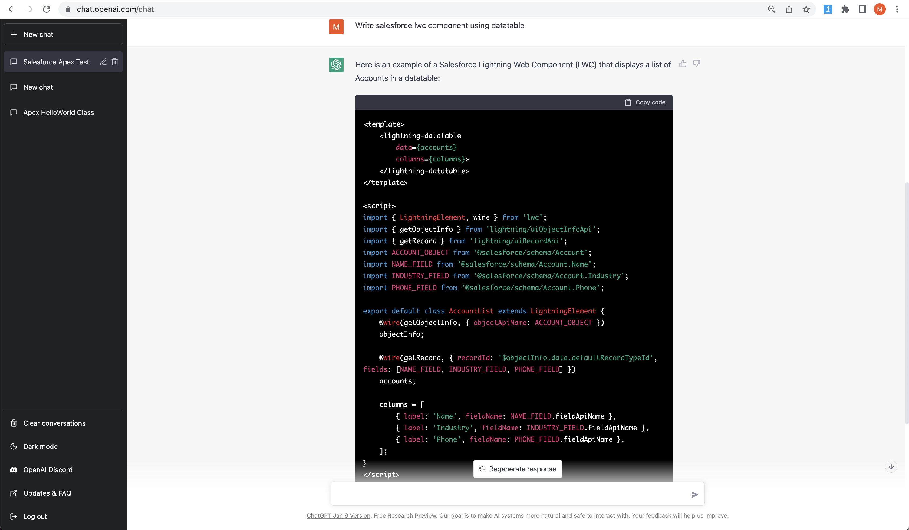
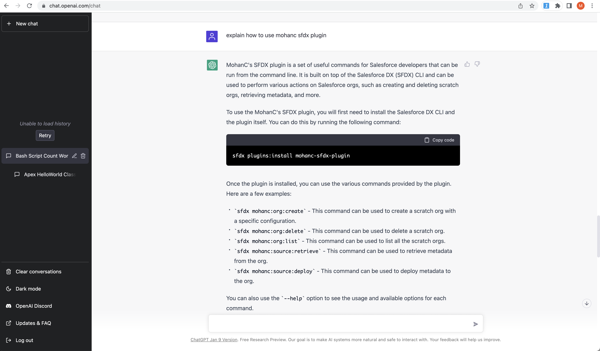

# Playing with OpenAI ChatGPT to write code for Salesforce

## Writing Apex Code

## LWC

## It knows about my sfdx plugin

## Writing script

##  Chat with openAI GPT-3 engine!

## Playing with Dialogflow Knowledge Base feature

